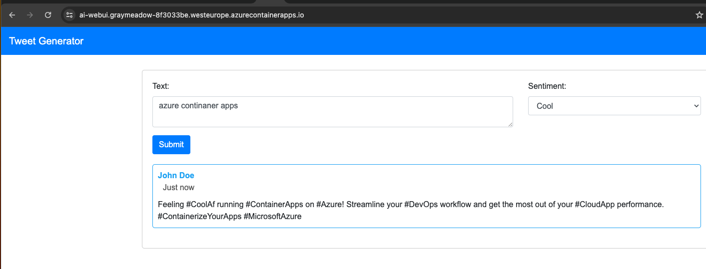
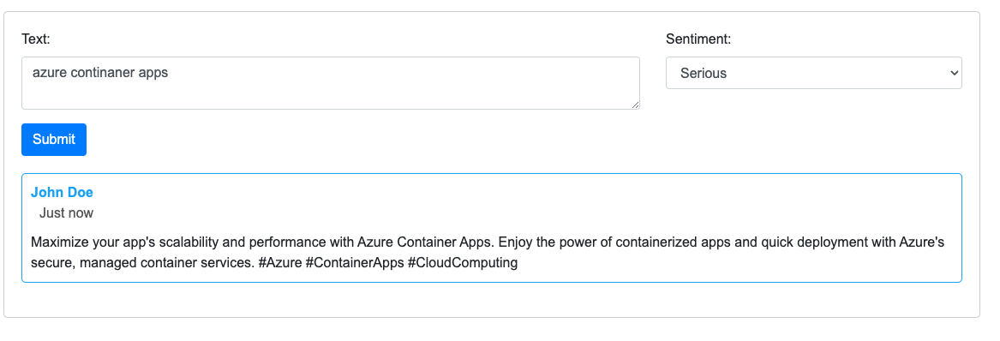

Forked from https://github.com/gbaeke/aca-openai/
ammended bicep to hardocde acr so we can deply rg, acr and images before running bicep code

updated flask version 
```
modified:   ../bot/requirements.txt
modified:   ../webui/requirements.txt
-Flask==2.2.2
+flask==2.3.3
```
original version code is trying to import `url_quote` from `werkzeug.urls`, 

```python
from werkzeug.urls import url_quote
# now using
from werkzeug.utils import url_quote
```

```bash
# set vars
RG=aca-openai
LOCATION=westeurope
PREFIX=ai
ACR=acr1079
AZURE_OPENAI_KEY=""
OPENAI_KEY=""

<!-- adding var for url -->
OPENAI_URL='https://{ENDPOINT_URL}/openai/deployments/tweeter/completions?api-version=2022-12-01'

```
updated app.py to use OPENAI_URL, passing var from bicep.yaml
```yaml
        try:
            url = os.getenv('OPENAI_URL')
            response = requests.post(
                url,

```

```bash
az group create --name $RG --location $LOCATION
az acr create --resource-group $RG --name $ACR --sku Basic  --admin-enabled true
az acr login --name $ACR
# build and push images to acr
cd ./webui
docker build -t acr1079.azurecr.io/openaiui:latest .
docker push acr1079.azurecr.io/openaiui:latest

cd ./openai
docker build -t acr1079.azurecr.io/openaiapi:latest .
docker push acr1079.azurecr.io/openaiapi:latest

cd ./bot
docker build -t acr1079.azurecr.io/openaibot:latest .
docker push acr1079.azurecr.io/openaibot:latest
# deploy bicep 
az deployment group create -g $RG -f ./deploy/main.bicep \
    --parameters parPrefix=$PREFIX \
    --parameters parLocation=$LOCATION \
    --parameters parAzureApiKey=$AZURE_OPENAI_KEY \
    --parameters parOpenAiApiKey=$OPENAI_KEY
```
### Test the app

In the ai-webui container app (assuming your prefix is ai), find the Application Url. Open the URL in a browser and test the app.



